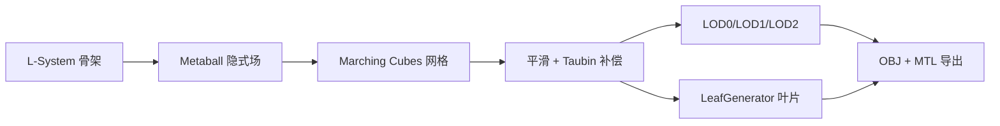

# PlantSim / Growth Lab

基于物理约束与隐式曲面的智能植物生长模拟与交互式编辑系统

本系统以 **L-System 植物骨架生成 → Metaball 隐式曲面建模 → Marching Cubes 等值面网格提取 → 网格优化与叶片生成 → 三维渲染** 为核心管线，构建了一套从植物结构生成到可交付静态模型（多级 LOD + 材质 OBJ）的完整实现，并配套 Vue 3 前端控制台与 C++ 引擎实时联动。

## 一、已完成模块

### 核心算法库（C++17）

| 模块 | 说明 | 关键文件 |
| --- | --- | --- |
| **植物数据结构** | `PlantNode` / `PlantModel` / `PlantTypes`：枝干、叶片、根系、芽点节点树，生命周期与生长状态 | `include/Plant/`、`include/Algorithm/PlantNode.h`、`src/Plant/PlantModel.cpp` |
| **L-System 骨架生成** | 公理 + 确定性/概率产生式，迭代字符串重写，三维海龟解释器，随机种子可复现；内置松树 / 柳树 / 樱花树 / 灌木预设 | `src/Algorithm/LSystem.cpp`、`TurtleInterpreter.cpp`、`PlantSkeletonPresets.cpp` |
| **Metaball 隐式曲面** | 紧支撑多项式核函数，点源 + 枝干线段场源融合，AABB + 三维标量场网格，多线程八叉树加速 | `src/Implicit/MetaballField.cpp` |
| **Marching Cubes 网格** | 256 项边表/三角表查表，边插值顶点去重，梯度法向，水密性校验 | `src/Geometry/MarchingCubes.cpp`、`MarchingCubesTables.h` |
| **网格优化** | 拉普拉斯平滑 + Taubin λ|μ 体积补偿、连接处凹陷局部增强、顶点聚类多级 LOD、法向重算 | `src/Geometry/MeshProcessing.cpp` |
| **叶片生成** | 参数化叶片曲面（黄金角错开、叶尖下垂、V 形折面），按骨架层级绑定，seed 可复现 | `src/Geometry/LeafGenerator.cpp` |
| **模型导出** | 多材质 OBJ + MTL（树皮 + 4 种叶色调色板）、LOD0/1/2、预览 PNG、摘要 JSON | `src/Geometry/MeshExporter.cpp` |

### 主程序与渲染引擎

- **`PlantSimulationSystem`**：Qt 5.14 + OpenGL 4.3 Core 引擎窗口，`SimulationEngine` 驱动植物骨架 → Metaball 场构建，`Renderer` 负责 Phong 光照渲染与 60 FPS 刷新。
- **渲染基础模块**：`Camera`、`Shader`、`Mesh`、`Light`、VAO/VBO、GLSL 着色器（`src/Rendering/`）。
- **WebSocket 服务**：Qt Network 实现 `ws://127.0.0.1:4317`，接收前端控制指令（如调整光照强度），并广播引擎环境状态。

### 前端控制台（Vue 3 + TypeScript + Vite）

- 植物预设切换（樱花 / 柳树 / 松树 / 百香果）、环境参数面板（光照强度、风场、水分）。
- 生长控制时间轴、交互工具（选择 / 轨道视角 / 风场预览）、事件流实时回显。
- 三维视口：Orbit 模式左键拖拽旋转、Shift+左键或中键平移、滚轮缩放、↺ 复位视角（`frontend/src/components/PlantViewport.vue`）。
- 与 C++ 引擎 WebSocket 实时联动，支持断线重连与离线预览。

### 命令行调试工具（`src/Tools/`）

| 工具 | 用途 |
| --- | --- |
| `PlantStructureDemo` | 打印植物节点树结构 |
| `LSystemSkeletonDemo` | L-System 字符串重写与骨架生成 |
| `MetaballFieldDemo` | 隐式场构建 + 阈值切片可视化 |
| `MarchingCubesDemo` | 等值面网格提取与导出 |
| `PlantModelExportDemo` | 完整导出管线：平滑 → LOD → 叶片 → OBJ/MTL |

## 二、技术栈

| 层次 | 技术 | 版本 | 状态 |
| --- | --- | --- | --- |
| 开发语言 | C++ | C++17 | ✅ |
| GUI 框架 | Qt | 5.14.2（`D:\Qt\5.14.2`） | ✅ |
| 三维渲染 | OpenGL | 4.3+（实测 RTX 4060 4.6） | ✅ |
| 数学计算 | Eigen | 3.4.0（`third_party/eigen`，header-only） | ✅ |
| 构建系统 | CMake | 3.16+ | ✅ |
| 编译器 | MSVC | 19.41（VS2022 Community） | ✅ |
| 前端 | Vue 3 + TypeScript + Vite | vue ^3.5 / vite ^7 | ✅ |
| AI 推理（规划） | ONNX Runtime（C++） | 1.17+ | 待接入 |
| AI 训练（规划） | Python + PyTorch | 3.9+ / 2.x | 待接入 |

## 三、系统架构

五层架构，各层通过接口解耦：

```text
┌─────────────────────────────────────────────────────────┐
│  表现层  UI Layer                                       │
│  MainWindow / ControlPanel / InteractionController      │
│  Vue 3 控制台（WebSocket 联动）                          │
├─────────────────────────────────────────────────────────┤
│  智能层  AI Layer（规划）                                │
│  AIGrowthPolicyNetwork / MorphologyPredictor /          │
│  HealthPredictor（ONNX Runtime）                        │
├─────────────────────────────────────────────────────────┤
│  逻辑层  Logic Layer                                    │
│  SimulationEngine / GrowthEngine / PhysicsSimulator     │
├─────────────────────────────────────────────────────────┤
│  引擎层  Engine Layer                                   │
│  MetaballField / MarchingCube / Renderer / Mesh         │
├─────────────────────────────────────────────────────────┤
│  数据层  Data Layer                                     │
│  PlantNode / PlantModel / Metaball / EnvironmentParams  │
└─────────────────────────────────────────────────────────┘
```

核心生成管线：



## 四、目录结构

```text
├── CMakeLists.txt          # CMake 构建脚本
├── src/                    # C++ 源码
│   ├── Plant/              # 植物数据模型
│   ├── Algorithm/          # L-System 与骨架生成
│   ├── Implicit/           # Metaball 隐式曲面
│   ├── Geometry/           # Marching Cubes / 优化 / 叶片 / 导出
│   ├── Engine/             # 模拟引擎
│   ├── Rendering/          # OpenGL 渲染
│   ├── Networking/         # WebSocket 服务
│   └── Tools/              # 命令行调试工具
├── include/                # 公共头文件（Plant / Algorithm / Implicit / Geometry）
├── frontend/               # Vue 3 前端控制台（plantsim-control-room）
│   ├── src/components/     # PlantViewport 三维视口
│   └── scripts/            # launch-dev / websocket-smoke
├── schemas/                # JSON Schema（骨架 / 场 / 网格 / 导出）
├── examples/               # 生成的示例产物（预设、网格、OBJ/MTL、预览图）
├── docs/                   # 周报文档（第4-8周）
├── third_party/eigen       # Eigen 3.4.0（header-only）
├── 技术栈文档.md            # 技术栈说明
├── 详细设计文档.md          # 详细设计说明
└── 需求分析文档.md          # 需求分析
```

## 五、构建与运行

### 环境要求

- Visual Studio 2022（含 CMake 与 MSVC）
- Qt 5.14.2 `msvc2017_64`（本机路径 `D:\Qt\5.14.2\msvc2017_64`）
- Eigen 3.4.0 放置于 `third_party/eigen`
- Node.js 18+（前端）

### 配置与编译（C++）

```powershell
# 配置（生成 VS2022 x64 工程，指定 Qt5 路径）
cmake -G "Visual Studio 17 2022" -A x64 -DCMAKE_PREFIX_PATH=D:/Qt/5.14.2/msvc2017_64 -S . -B build

# 编译（Release）
cmake --build build --config Release
```

### 启动主引擎

```powershell
$env:Path = "D:\Qt\5.14.2\msvc2017_64\bin;$env:Path"
.\build\Release\PlantSimulationSystem.exe
```

### 启动前端控制台

```powershell
cd frontend
npm install
npm run dev -- --host 127.0.0.1 --port 5173
```

浏览器打开 [http://127.0.0.1:5173](http://127.0.0.1:5173)。前端通过 `ws://127.0.0.1:4317` 连接 C++ 引擎（可用 `VITE_ENGINE_WS_URL` 覆盖）。

### 验证联动链路

点击前端「光照 +10%」：

```text
Vue 点击光照 +10%
    -> WebSocket { type: "adjust_light", value: 0.9 }
    -> C++ 输出 Light = 0.9
    -> C++ 输出 Environment Updated
    -> Vue 事件流显示 Environment Updated
```

### 前端构建与冒烟测试

```powershell
cd frontend
npm run build        # vue-tsc 类型检查 + vite build
npm run smoke        # C++ 引擎已启动时验证 WebSocket 回执
```

## 六、示例产物（`examples/`）

| 产物 | 说明 |
| --- | --- |
| `lsystem_cherry.json` 等 | 松树 / 柳树 / 樱花树 / 灌木 L-System 骨架预设 |
| `plant_skeleton.json` | 植物节点树骨架 JSON |
| `metaball_cherry_field.json` / `_slice.csv/.png` | 隐式场摘要与阈值切片 |
| `marching_cubes_cherry_mesh.json` / `.obj` / `_preview.png` | Marching Cubes 网格 |
| `plant_cherry_lod0/1/2.obj` + `.mtl` | 多级 LOD 模型（材质 OBJ） |
| `plant_cherry_export.json` / `_preview.png` | 导出摘要与预览图 |

实测参考（樱花树）：平滑后 LOD0 9362 顶点 / 18728 三角形，LOD1 约 34%、LOD2 约 14%；Taubin 平滑体积保持误差 < 0.2%；99 片叶片 / 1980 三角形。

## 七、开发进度（对应 `docs/` 周报）

| 周次 | 里程碑 | 交付 |
| --- | --- | --- |
| 第4周 | 植物数据结构 | `PlantNode` / `PlantModel`、JSON + Schema、`PlantStructureDemo` |
| 第5周 | L-System 植物骨架生成 | 字符串重写、三维海龟解释器、预设、`LSystemSkeletonDemo` |
| 第6周 | Metaball 隐式曲面 | 标量场构建、切片可视化、`MetaballFieldDemo` |
| 第7周 | Marching Cubes 网格提取 | 等值面提取、法向、水密校验、`MarchingCubesDemo` |
| 第8周 | 模型优化与叶片生成 | 平滑/Taubin、LOD、叶片、材质导出、`PlantModelExportDemo` |

## 八、后续规划

- **物理约束模拟**：向光性、向地性、风场、资源竞争的实时生长约束。
- **AI 智能系统**：PyTorch 离线训练 + ONNX 导出 + C++ ONNX Runtime 推理，决策模式 Rule / AI / Hybrid。
- **交互式编辑**：节点拾取、变换与参数编辑。
- **渲染增强**：Compute Shader 隐式场采样、PBR、实时阴影。

## 九、文档

- [需求分析文档](需求分析文档.md)
- [技术栈文档](技术栈文档.md)
- [详细设计文档](详细设计文档.md)
- [docs/ 周报](docs/)
