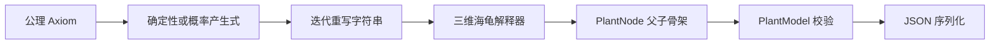

# 第5周：L-System 植物骨架生成

## 1. 本周目标

本周在第4周 `PlantNode` / `PlantModel` 数据结构之上，实现了可复现的随机 L-System 和三维海龟解释器。生成流程如下：



## 2. 完成内容

### 2.1 字符串重写系统

核心文件：

- `include/Algorithm/LSystem.h`
- `src/Algorithm/LSystem.cpp`

支持：

- 设置公理：`setAxiom()`；
- 确定性产生式：`setRule(symbol, replacement)`；
- 概率产生式：`addProduction(symbol, replacement, weight)`；
- 指定迭代次数；
- 使用 `std::mt19937` 和权重离散分布随机选择产生式；
- 指定随机种子，同一种子生成结果可复现；
- 最大字符串长度保护；
- 返回完成迭代数和是否截断等统计信息；
- 保留原有 `rules`、`generate()`、`treePreset()` API，主程序保持兼容。

示例：

```cpp
LSystem system;
system.setAxiom(QStringLiteral("X"));
system.addProduction(QChar('X'), QStringLiteral("F[+X][-X]"), 3.0);
system.addProduction(QChar('X'), QStringLiteral("F[&X][/X]"), 1.0);
system.setRule(QChar('F'), QStringLiteral("FF"));

const auto result = system.generateDetailed(system.axiom, 5, 20260804u);
```

### 2.2 三维海龟解释器

核心文件：

- `include/Algorithm/TurtleInterpreter.h`
- `src/Algorithm/TurtleInterpreter.cpp`

| 符号 | 行为 |
|---|---|
| `F`、`G` | 沿当前方向前进并生成枝干节点 |
| `f` | 前进但不生成节点 |
| `+`、`-` | 绕局部 Z 轴正向/反向旋转 |
| `&`、`^` | 绕局部 X 轴俯仰 |
| `\`、`/` | 绕局部 Y 轴扭转 |
| `|` | 绕局部 Z 轴旋转 180° |
| `!` | 显式执行一次半径衰减 |
| `[` | 保存位置、方向、尺度和当前父节点，并进入下一分枝层级 |
| `]` | 恢复最近保存的海龟状态和父节点 |
| `L`、`R`、`B` | 记录叶片、根系、芽点标记统计，供后续器官生成模块使用 |

海龟姿态使用 Eigen 四元数保存，所有旋转均在局部坐标系中执行，因此可以生成真正的三维骨架，而不是只在一个平面内分枝。

`PlantRule` 新增配置包括：

- `angleVariationDegrees`：随机角度偏移；
- `lengthVariation` / `radiusVariation`：枝段长度和半径随机比例；
- `lengthScale` / `radiusScale`：每次前进后的衰减系数；
- `minimumLength` / `minimumRadius`：避免无限衰减到零；
- `decayLengthOnForward` / `decayRadiusOnForward`：控制自动衰减；
- `randomSeed`：海龟随机种子。

解释器还会统计枝段数、旋转次数、入栈/出栈次数、最大栈深度、未匹配括号和器官标记数。

### 2.3 多形态预设

核心文件：

- `include/Algorithm/PlantSkeletonPresets.h`
- `src/Algorithm/PlantSkeletonPresets.cpp`

当前提供四种预设：

| 参数名 | 形态特点 | 默认迭代 |
|---|---|---:|
| `pine` | 主干明显、层级紧凑 | 5 |
| `willow` | 细长并带较多俯仰、扭转 | 5 |
| `cherry` | 横向舒展，使用概率产生式 | 5 |
| `shrub` | 低矮、密集、多方向扩张 | 4 |

每种预设都独立配置公理、产生式、角度、随机扰动、初始枝长/半径以及衰减系数。

## 3. 演示程序

源文件：`src/Tools/LSystemSkeletonDemo.cpp`

构建：

```powershell
cmake -S . -B build
cmake --build build --config Release --target LSystemSkeletonDemo
```

运行前将 Qt DLL 目录加入 `Path`：

```powershell
$env:Path = "D:\Qt\5.14.2\msvc2017_64\bin;$env:Path"
```

生成一种植物：

```powershell
.\build\Release\LSystemSkeletonDemo.exe `
  --preset cherry `
  --iterations 5 `
  --seed 20260804 `
  --output examples\lsystem_cherry.json
```

一次生成全部预设：

```powershell
.\build\Release\LSystemSkeletonDemo.exe `
  --preset all `
  --seed 20260804 `
  --output examples
```

显示小规模父子树：

```powershell
.\build\Release\LSystemSkeletonDemo.exe `
  --preset shrub `
  --iterations 2 `
  --show-tree `
  --output examples\lsystem_shrub_small.json
```

可用参数：

- `--preset pine|willow|cherry|shrub|all`
- `--iterations N`
- `--seed N`
- `--output FILE_OR_DIRECTORY`
- `--show-sequence`
- `--show-tree`

## 4. JSON 输出

生成的骨架继续使用第4周定义的 `PlantModel` JSON 格式和 `schemas/plant_skeleton.schema.json`。每条海龟绘制指令会形成一条父子边：

```json
{
  "id": 12,
  "parentId": 7,
  "type": "branch",
  "position": [1.25, 3.40, -0.62],
  "direction": [0.31, 0.91, -0.27],
  "radius": 0.043,
  "length": 0.286,
  "age": 0.0,
  "depth": 8,
  "generation": 3,
  "active": true
}
```

本次生成的示例数据：

- `examples/lsystem_pine.json`
- `examples/lsystem_willow.json`
- `examples/lsystem_cherry.json`
- `examples/lsystem_shrub.json`

## 5. 验证结果

使用随机种子 `20260804`、默认迭代次数：

| 预设 | 字符数 | 枝段数 | 节点数 | 最大栈深度 | JSON 往返 |
|---|---:|---:|---:|---:|---|
| pine | 5085 | 992 | 993 | 5 | 通过 |
| willow | 4943 | 852 | 853 | 5 | 通过 |
| cherry | 1740 | 211 | 212 | 5 | 通过 |
| shrub | 1411 | 85 | 86 | 4 | 通过 |

验证项目：

1. `PlantLSystem`、`LSystemSkeletonDemo` 和 `PlantSimulationSystem` 均可在 Release 模式构建；
2. 相同种子的字符串重写结果完全一致；
3. 不同种子的樱花树 JSON SHA-256 不同；
4. 四种预设均无未匹配 `]` 或未关闭 `[`；
5. 生成的 `PlantModel` 均通过结构、父子关系、深度、半径和长度校验；
6. 四个 JSON 文件保存后均可重新加载，节点数和枝干数不变。

## 6. 后续扩展

- 将 `L`、`R`、`B` 标记转换为真正的 `Leaf`、`Root` 和芽点器官；
- 支持带参数符号，例如 `F(0.8)`、`+(22.5)`；
- 从 JSON/UI 动态加载公理和产生式；
- 将骨架枝段转换为圆柱网格或隐式曲面；
- 将环境光照、重力和空间竞争作为产生式或海龟旋转约束。

