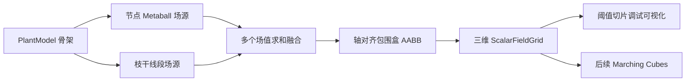

# 第6周：Metaball 隐式曲面标量场

## 1. 本周目标

本周将第5周生成的 `PlantNode` 骨架转换为连续的 Metaball 隐式标量场，并实现三维采样网格和交互式切片调试程序。本周只负责建立隐式场；等值面三角网格提取将在后续 Marching Cubes 模块中完成。



## 2. 核心文件

- `include/Implicit/MetaballField.h`
- `src/Implicit/MetaballField.cpp`
- `src/Tools/MetaballFieldDemo.cpp`
- `schemas/metaball_field_summary.schema.json`

`CMakeLists.txt` 新增：

- 静态库：`PlantImplicitSurface`
- 调试程序：`MetaballFieldDemo`

`SimulationEngine` 现在会在植物骨架建立后同步调用 `MetaballField::rebuildFromPlant()`，因此主程序已经持有与当前植物对应的隐式场。

## 3. 标量场数学模型

### 3.1 紧支撑核函数

点源和线段源统一采用紧支撑多项式核函数：

\[
g(d,R,w)=
\begin{cases}
w\left(1-\frac{d^2}{R^2}\right)^2, & d<R \\
0, & d\ge R
\end{cases}
\]

其中：

- `d`：采样点到场源的距离；
- `R`：场源影响半径；
- `w`：场源权重。

全部场源在采样点 `p` 处的标量值为：

\[
F(p)=\sum_i g_i(p)
\]

等值面定义为：

\[
F(p)=T
\]

- `F(p) >= T`：位于等值面内部；
- `F(p) < T`：位于等值面外部；
- `T` 由 `setIsoThreshold()` 或 `MetaballFieldSettings::isoThreshold` 调整。

`evaluateSigned(p)` 返回 `F(p)-T`，方便后续 Marching Cubes 直接判断体素角点内外。

### 3.2 节点场源

`MetaballNodeSource` 包含：

```cpp
struct MetaballNodeSource {
    Vec3 center;
    float influenceRadius;
    float weight;
    int ownerNodeId;
    bool junction;
};
```

节点场源主要用于：

- 封闭主干根部和枝条端点；
- 增强父枝与多个子枝连接处的融合；
- 通过连接点附加场值减少枝干交叉处的尖锐收缩。

### 3.3 枝干线段场源

每条父子骨架边转换为一个 `MetaballSegmentSource`：

```cpp
struct MetaballSegmentSource {
    Vec3 start;
    Vec3 end;
    float startInfluenceRadius;
    float endInfluenceRadius;
    float weight;
    int parentNodeId;
    int childNodeId;
};
```

计算时先将采样点投影到有限线段，得到最近点参数 `t`，然后在线段两端半径之间插值：

\[
R(t)=(1-t)R_{start}+tR_{end}
\]

因此枝干可以从粗端平滑过渡到细端，而不是使用大量离散球近似线段。

## 4. 多场融合与连接平滑

节点源和线段源的贡献通过直接求和融合。相邻线段在连接处自然重叠，连接点场源进一步控制局部圆滑程度。

配置项：

```cpp
MetaballFieldSettings settings;
settings.isoThreshold = 0.5f;
settings.influenceScale = 2.0f;
settings.segmentWeight = 1.0f;
settings.jointSmoothness = 0.65f;
settings.minimumSourceRadius = 0.005f;
settings.boundsPadding = 0.1f;
```

`jointSmoothness` 的取值范围为 `[0, 1]`：

- `0`：连接点附加场较弱，枝干轮廓更紧；
- `1`：分叉连接点影响半径和权重更大，融合区域更圆滑、更饱满。

实测同一棵三迭代樱花树、阈值 `0.5`：

| 平滑度 | 节点场源数 | 最大场值 | 阈值内部采样点 |
|---:|---:|---:|---:|
| 0.0 | 10 | 3.9055 | 1774 |
| 1.0 | 20 | 4.8904 | 2087 |

这说明平滑度提高后，连接区域获得了更强的融合场。

## 5. 空间包围盒

`BoundingBox3` 实现轴对齐包围盒，支持：

- 有效性检查；
- 获取中心和尺寸；
- 按点扩张；
- 按点和半径扩张；
- 合并另一个包围盒；
- 增加外部留白。

Metaball 场的自动包围盒会包含：

- 所有节点场源中心及影响半径；
- 所有线段起点、终点及对应影响半径；
- `boundsPadding` 指定的额外采样余量。

因此包围盒不是只包住植物骨架中心线，而是完整包住所有非零场值区域。

## 6. 三维采样网格

`ScalarFieldGrid` 保存：

- `bounds`：采样包围盒；
- `dimensions`：X/Y/Z 三个方向的格点数；
- `spacing`：实际三轴采样间距；
- `values`：按 `x + nx*(y + ny*z)` 展平的标量数组；
- 最小、最大、平均场值；
- 大于等值面阈值的采样点数量；
- 请求间距是否因内存保护而自动调整。

使用方法：

```cpp
MetaballField field;
field.rebuildFromPlant(plantModel, settings);

ScalarFieldGrid grid = field.sampleGrid(
    0.05f,       // 请求采样间距
    2000000      // 最大采样点数
);

float sample = grid.value(x, y, z);
Vec3 position = grid.position(x, y, z);
```

当请求间距过小时，采样器会增大实际间距，确保总采样数不超过 `maximumSampleCount`，避免意外占用过多内存。

## 7. 隐式场调试可视化

`MetaballFieldDemo` 提供交互式 Qt 调试窗口，能够实时调整：

- 等值面阈值；
- 枝干连接平滑度；
- 三维采样间距；
- X/Y/Z 切片方向；
- 切片位置。

颜色含义：

- 蓝色：场值低于阈值；
- 橙色：场值高于阈值；
- 白色：当前阈值对应的二维等值线。

构建：

```powershell
cmake -S . -B build
cmake --build build --config Release --target MetaballFieldDemo
```

启动交互窗口：

```powershell
$env:Path = "D:\Qt\5.14.2\msvc2017_64\bin;$env:Path"

.\build\Release\MetaballFieldDemo.exe `
  --preset cherry `
  --iterations 4 `
  --threshold 0.5 `
  --smoothness 0.65 `
  --spacing 0.05
```

无窗口导出：

```powershell
.\build\Release\MetaballFieldDemo.exe `
  --preset cherry `
  --iterations 4 `
  --seed 20260804 `
  --threshold 0.5 `
  --smoothness 0.65 `
  --spacing 0.05 `
  --axis z `
  --slice 0.5 `
  --output examples\metaball_cherry_slice.png `
  --summary examples\metaball_cherry_field.json `
  --csv examples\metaball_cherry_slice.csv `
  --no-window
```

## 8. 示例输出

- `examples/metaball_cherry_slice.png`：标量场 Z 切片热力图；
- `examples/metaball_cherry_slice.csv`：同一切片的原始浮点采样值；
- `examples/metaball_cherry_field.json`：包围盒、网格和场值统计；
- `schemas/metaball_field_summary.schema.json`：摘要 JSON Schema。

默认示例统计：

| 项目 | 数值 |
|---|---:|
| L-System 预设 | cherry |
| 迭代次数 | 4 |
| 植物节点 | 66 |
| 节点场源 | 66 |
| 枝干线段场源 | 65 |
| 网格尺寸 | 65 × 116 × 35 |
| 总采样点 | 263900 |
| 等值面阈值 | 0.5 |
| 场值范围 | 0 ～ 5.2467 |
| 阈值内部采样点 | 14125 |

## 9. 阈值验证

同一棵植物、相同采样网格和平滑度下：

| 阈值 | 阈值内部采样点 |
|---:|---:|
| 0.3 | 2301 |
| 0.9 | 1281 |

阈值升高后等值面收缩，内部采样点数量减少，符合隐式曲面定义。

## 10. 下一步

第7周可直接使用 `ScalarFieldGrid` 和 `evaluateSigned()` 实现 Marching Cubes：

1. 遍历网格立方体；
2. 根据八个角点相对阈值的符号生成 case index；
3. 在线性插值后的边交点生成顶点；
4. 使用 `MetaballField::gradient()` 计算表面法线；
5. 输出可渲染的枝干三角网格。
