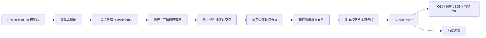

# 第7周：Marching Cubes 网格提取

## 1. 本周目标

在第6周 `ScalarFieldGrid` 三维标量场的基础上，实现完整的 Marching Cubes 算法，把 Metaball 隐式曲面转换为可直接渲染的三角形网格，并把网格数据以标准格式传递给前端。



## 2. 核心文件

- `include/Geometry/MarchingCubesTables.h`：256 项边表与三角形表
- `include/Geometry/MarchingCubes.h`：`SurfaceMesh`、`SurfaceMeshStats` 数据结构与算法接口
- `src/Geometry/MarchingCubes.cpp`：算法实现
- `src/Tools/MarchingCubesDemo.cpp`：命令行提取与导出工具
- `schemas/marching_cubes_mesh.schema.json`：前端网格 JSON Schema

`CMakeLists.txt` 新增：

- 静态库：`PlantGeometry`（依赖 `PlantImplicitSurface`）
- 工具程序：`MarchingCubesDemo`

## 3. 算法实现要点

### 3.1 体素网格

直接复用第6周的 `ScalarFieldGrid`：

- `dimensions`：三轴格点数；
- `value(x, y, z)` / `position(x, y, z)`：格点场值与世界坐标；
- 格点按 `x + nx*(y + ny*z)` 展平存储。

体素（立方体）遍历范围为 `(nx-1) × (ny-1) × (nz-1)`，cherry 预设 0.05 间距下共 250240 个体素。

### 3.2 立方体顶点状态判断

角点编号约定（y 向上，底面 0-1-2-3，顶面 4-5-6-7）：

```text
      4----------5
     /|         /|
    7----------6 |
    | |        | |
    | 0--------|-1
    |/         |/
    3----------2
```

对每个体素读取 8 个角点场值，角点 `i` 满足 `F >= isoLevel` 时把 `caseIndex` 第 `i` 位置 1，与第6周 `evaluateSigned()` 的内外定义一致。`caseIndex == 0`（全外）直接跳过，`caseIndex == 255`（全内）只计入统计，因此只处理与等值面真正相交的 9354 个活跃体素（约占 3.7%）。

### 3.3 边表与三角形表

`MarchingCubesTables.h` 提供两张经典查找表：

- `kEdgeTable[256]`：12 位掩码，bit `e` 置 1 表示第 `e` 条边与等值面相交；
- `kTriangleTable[256][16]`：每行按 3 个边号一组给出 1～5 个三角形，`-1` 结束。

12 条边的端点约定：边 0-3 为底面四边，边 4-7 为顶面四边，边 8-11 为四条竖直边（详见表头注释）。

### 3.4 等值面交点计算

对每条相交边做线性插值：

\[
t=\frac{T-F(p_0)}{F(p_1)-F(p_0)},\qquad p=p_0+t\,(p_1-p_0)
\]

分母接近 0（两端场值几乎相同）时取 `t = 0.5`，并把结果钳制到 `[0, 1]`，避免数值外推。

### 3.5 消除重复顶点

同一条网格边最多被 4 个体素共享。若不处理，每个体素独立生成顶点会产生 4 倍冗余并撕裂网格。

实现：把每条网格边规范化为「低端点 + 轴向」，以

```cpp
key = linearIndex(baseX, baseY, baseZ) * 3 + axis   // axis ∈ {0:x, 1:y, 2:z}
```

作为全局唯一键缓存到哈希表。后续体素访问同一条边时直接复用已有顶点索引。

实测 cherry 预设：逐体素顶点 37448 个，去重后 9362 个，去重比恰好 4×，与理论值一致。

### 3.6 顶点法向量

分两步：

1. 对采样网格做一次中心差分（边界退化为前/后向差分），预计算每个格点的场梯度 `∇F`；
2. 生成边交点时用同一个参数 `t` 对两端梯度线性插值并单位化。

场值朝内部增大（内部 `F >= T`），因此**外法向量取梯度反方向**：`n = -normalize(∇F)`。梯度退化的极端情况回落到垂直于边的任意方向再单位化，保证不会出现 NaN。

相比面法向量平均方案，网格梯度法向量与隐式曲面解析方向一致，光照更平滑（见第 7 节预览图）。

### 3.7 网格连接问题处理

- **跨体素裂缝**：规范边键顶点共享保证相邻体素在公共边上引用同一顶点，几何上天然闭合；
- **三角形绕序**：提取后按散度定理计算有向体积 `V = Σ a·(b×c)/6`，若 `V < 0` 说明绕序与法向量相反，自动翻转全部三角形（本次提取 `orientationFlipped=false`，体积为正 1.69）；
- **水密性校验**：统计每条无向边被三角形引用的次数，封闭曲面应恰好为 2。`SurfaceMeshStats::boundaryEdgeCount` 记录异常边数，`MarchingCubes::validate()` 在水密性、索引范围、法向量单位长度、体积符号任一不满足时返回失败。

### 3.8 输出数据结构

```cpp
struct SurfaceMesh {
    std::vector<Vec3> positions;          // 去重后顶点
    std::vector<Vec3> normals;            // 单位外法向量
    std::vector<std::uint32_t> indices;   // 每 3 个为一个三角形
    SurfaceMeshStats stats;               // 体素/顶点/水密性/体积等统计
};
```

`Mesh`（OpenGL 渲染类）的 `MeshVertex{position, normal, color}` 与该结构一一对应，可直接填充上传 GPU。

## 4. 工具程序 MarchingCubesDemo

构建：

```powershell
cmake -S . -B build
cmake --build build --config Release --target MarchingCubesDemo
```

运行（默认 cherry，4 次迭代）：

```powershell
$env:Path = "D:\Qt\5.14.2\msvc2017_64\bin;$env:Path"

.\build\Release\MarchingCubesDemo.exe `
  --preset cherry `
  --iterations 4 `
  --seed 20260804 `
  --threshold 0.5 `
  --smoothness 0.65 `
  --spacing 0.05 `
  --obj examples\marching_cubes_cherry.obj
```

常用参数：

| 参数 | 含义 | 默认值 |
|---|---|---|
| `--preset` | 植物预设 pine / willow / cherry / shrub | cherry |
| `--iterations` | L-System 迭代次数 | ≤4 |
| `--threshold` | 等值面阈值 | 0.5 |
| `--smoothness` | 枝干连接平滑度 | 0.65 |
| `--spacing` | 标量场采样间距 | 0.05 |
| `--obj` | OBJ 输出路径 | examples/marching_cubes_cherry.obj |
| `--mesh-json` | 前端网格 JSON 输出路径 | `<obj名>_mesh.json` |
| `--summary` | 统计摘要 JSON 路径 | `<obj名>_summary.json` |
| `--preview` | 光照预览 PNG 路径 | `<obj名>_preview.png` |
| `--azimuth` / `--elevation` | 预览相机角度 | -35° / 18° |
| `--no-preview` | 跳过软渲染预览 | — |

提取失败或网格未通过校验时以非零码退出，可直接接入 CI。

## 5. 输出示例

| 文件 | 内容 |
|---|---|
| `examples/marching_cubes_cherry.obj` | `v`/`vn`/`f` 标准 OBJ，可导入 Blender 等任意 DCC 检查 |
| `examples/marching_cubes_cherry_mesh.json` | 前端渲染用网格（展平数组 + 元数据） |
| `examples/marching_cubes_cherry_summary.json` | 提取统计摘要 |
| `examples/marching_cubes_cherry_preview.png` | 软渲染光照预览（画家算法 + 法向量 Lambert/镜面光照） |
| `schemas/marching_cubes_mesh.schema.json` | 网格 JSON Schema，已通过校验 |

默认参数实测统计：

| 项目 | 数值 |
|---|---:|
| 标量场网格 | 65 × 116 × 35 |
| 体素总数 | 250240 |
| 活跃体素 | 9354 |
| 全内体素 | 9762 |
| 去重前顶点（逐体素） | 37448 |
| 去重后顶点 | 9362（4×） |
| 三角形 | 18728 |
| 流形共享边 | 28092 |
| 边界边 | **0（水密）** |
| 有向体积 | 1.6906 |
| 表面积 | 15.5877 |

## 6. 分辨率与阈值验证

同一棵树、相同阈值 0.5，只改采样间距：

| 间距 | 网格尺寸 | 三角形 | 水密 | 表面积 | 体积 |
|---:|---|---:|:---:|---:|---:|
| 0.08 | 42 × 74 × 23 | 7252 | ✓ | 15.5953 | 1.6981 |
| 0.05 | 65 × 116 × 35 | 18728 | ✓ | 15.5877 | 1.6906 |
| 0.03 | 106 × 190 × 55 | 51220 | ✓ | 15.5934 | 1.6879 |

表面积与体积在三种分辨率下几乎不变，说明等值面提取收敛、实现正确。

同一棵树、间距 0.05，阈值提高到 0.8：三角形 16608、体积收缩到 1.3096、表面积 13.7031，仍然水密——与第6周「阈值升高等值面收缩」的结论一致。

## 7. 法向量与光照效果

`marching_cubes_cherry_preview.png` 使用逐顶点梯度法向量做 Lambert 漫反射 + Blinn 高光软渲染：枝干圆柱面明暗过渡平滑，Metaball 融合的分叉连接处没有法向量突变，验证了法向量插值与水密连接的正确性。

## 8. 网格传递给前端

前端交接格式为 `*_mesh.json`（符合 `schemas/marching_cubes_mesh.schema.json`）：

```json
{
  "format": "PlantSim Marching Cubes Mesh",
  "version": 1,
  "meta": { "preset": "cherry", "isoLevel": 0.5, "grid": { "..." }, "mesh": { "..." } },
  "positions": [x0, y0, z0, ...],
  "normals":   [nx0, ny0, nz0, ...],
  "indices":   [a, b, c, ...]
}
```

前端（Three.js / WebGL）加载方式：

```ts
const mesh = await (await fetch('/meshes/marching_cubes_cherry_mesh.json')).json()
const geometry = new THREE.BufferGeometry()
geometry.setAttribute('position', new THREE.Float32BufferAttribute(mesh.positions, 3))
geometry.setAttribute('normal', new THREE.Float32BufferAttribute(mesh.normals, 3))
geometry.setIndex(mesh.indices)
```

`meta.mesh` 中的 `vertexCount`/`triangleCount` 可用于前端校验数组长度（`positions.length === vertexCount * 3`），`watertight`、`signedVolume` 可用于展示提取质量。后续周次可在 `WebSocketServer` 增加 `mesh_updated` 消息直接推送该 JSON，替换当前的静态文件加载方式。

## 9. 本周输出清单

- [x] Marching Cubes 算法（`PlantGeometry` 库，含边表/三角形表）
- [x] 植物枝干网格（cherry 等四种预设均可提取）
- [x] 三角形顶点和索引数据（OBJ + 前端网格 JSON）
- [x] 法向量和光照效果（梯度法向量 + 软渲染预览 PNG）

## 10. 下一步

1. 把 `MarchingCubes::extract()` 接入 `SimulationEngine`，骨架更新后自动重建网格；
2. 主程序 `Renderer` 用提取的枝干网格替换当前校准立方体，实现 OpenGL 实时渲染；
3. WebSocket 推送 `mesh_updated`，前端 Three.js 视口渲染真实枝干网格；
4. 对歧义面（ambiguous face）可引入渐近线判别法（asymptotic decider）进一步增强极端配置下的拓扑一致性。
