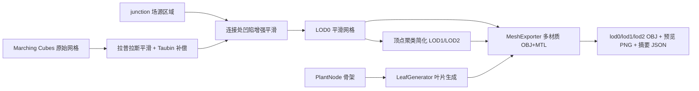

# 第8周：模型优化与叶片生成

## 1. 本周目标

把第7周 Marching Cubes 提取的原始枝干网格加工为可交付的完整植物静态模型：平滑曲面、消除连接凹陷、简化出多级 LOD、生成并绑定叶片、配置材质与程序化颜色，最后以带材质的 OBJ 导出。



## 2. 核心文件

- `include/Geometry/MeshProcessing.h` / `src/Geometry/MeshProcessing.cpp`：平滑、简化、法向量重算、统计
- `include/Geometry/LeafGenerator.h` / `src/Geometry/LeafGenerator.cpp`：参数化叶片生成与节点绑定
- `include/Geometry/MeshExporter.h` / `src/Geometry/MeshExporter.cpp`：多材质 OBJ + MTL 导出
- `src/Tools/PlantModelExportDemo.cpp`：完整导出管线工具
- `schemas/plant_model_export.schema.json`：导出摘要 JSON Schema

第7周的 `finalizeStats` 已重构为 `MeshProcessing::computeStats()`，Marching Cubes 与后处理共用同一套水密性 / 体积统计代码。

## 3. 拉普拉斯平滑

### 3.1 基础迭代

\[
p_i \leftarrow p_i + \lambda \left( \frac{1}{|N(i)|}\sum_{j \in N(i)} p_j - p_i \right)
\]

邻接表由三角形索引构建（去重邻居）。默认 `lambda = 0.5`，迭代 8 次。

### 3.2 Taubin 体积补偿

纯拉普拉斯平滑每步都在收缩曲面，枝干会越磨越细。实现采用 Taubin λ|μ 方案：每个迭代在正步之后追加一个负步（`mu = -0.53`），把低频次的几何收缩“推回去”。

实测 cherry 树（8 次迭代、`lambda = 0.5`）：原始有向体积 1.6906；不做补偿的纯拉普拉斯收缩到 1.5569（损失 7.9%）；Taubin 补偿后 1.6932，体积完整保持（+0.16% 在数值误差范围内）。

### 3.3 连接处凹陷处理

Metaball 等值面在多枝分叉处场值被摊薄，容易形成环状凹陷。处理方式：

1. 从 `MetaballField::nodeSources()` 取出 `junction = true` 的连接点场源（cherry 树共 13 个区域）；
2. 标记位于 `影响半径 × 1.3` 范围内的网格顶点；
3. 全局平滑完成后，仅对这些顶点追加 6 次更强的局部平滑（`junctionLambda = 0.65`，同样带负步补偿）。

局部处理避免了对整棵树过度平滑导致的细节丢失。

### 3.4 平滑后的一致性

平滑只移动顶点位置，不改变连接关系，因此 LOD0 保持第7周的水密性（边界边仍为 0），`MarchingCubes::validate()` 在平滑后重新执行通过；法向量按新几何以面积加权面法向量重算。

## 4. 网格简化与 LOD

采用**顶点聚类**（vertex clustering）简化：

1. 按 `cellSize` 把空间划分为格子，同一格子内的顶点合并为一个代表点（平均位置）；
2. 三角形顶点重映射到代表点；
3. 丢弃坍缩成点/线的退化面，并按排序顶点三元组去除完全重复的三角形；
4. 重算面积加权法向量与统计信息。

生成三个细节层次：

| 层级 | 聚类格子 | 顶点 | 三角形 | 相对 LOD0 |
|---|---:|---:|---:|---:|
| LOD0（平滑后） | — | 9362 | 18728 | 100% |
| LOD1 | 0.075 | 3216 | 6445 | 34% |
| LOD2 | 0.12 | 1294 | 2602 | 14% |

渲染系统可按相机距离切换：近景 LOD0、中景 LOD1、远景 LOD2。叶片网格三角形很少（1980 个），三个 LOD 均保留完整叶片。

## 5. 叶片生成与绑定

### 5.1 绑定规则

`LeafGenerator::generate()` 遍历 `PlantNode` 骨架：

- 层级 `generation >= minGeneration`（默认 2，主干不长叶）且非根节点才绑定；
- 末端节点（无子节点）每节点 3 片叶；
- 高层级中间节点每节点 1 片叶。

cherry 预设（4 次迭代）实测：45 个绑定节点，99 片叶子。

### 5.2 叶片朝向

- 以节点生长方向 `branchDirection` 为轴建立正交基 `(U, V)`；
- 同一节点的多片叶子按**黄金角**（≈137.5°）在方位角上错开，避免叶片重叠；
- 中脉方向 = 枝干方向向侧面倾斜 `tilt`（默认 55°，带 ±15% 抖动）；
- 叶宽方向尽量取水平，法向量保持朝上。

### 5.3 参数化叶片曲面

每片叶子是 `(segments+1) × 3` 的顶点条带（左缘 / 中脉 / 右缘），中脉参数 `t ∈ [0,1]`：

- 宽度轮廓：`w(t) = halfWidth · sin(πt)^0.8`，基部与叶尖收窄；
- 叶尖下垂：中脉沿负法向偏移 `droop · L · t²`；
- 横截面下折：左右边缘沿负法向偏移 `fold · w(t)`，形成 V 形折面。

尺寸带 ±30% 抖动；全部随机数来自 `std::mt19937(seed)`，同一 seed 结果完全可复现。每片叶子 20 个三角形，99 片共 1980 个。

## 6. 材质与程序化颜色

`MeshExporter` 同时写出 `.mtl` 材质库：

| 材质 | 用途 | Kd | 说明 |
|---|---|---|---|
| `bark` | 枝干 | (0.45, 0.30, 0.20) | 低高光树皮 |
| `leaf_0`～`leaf_3` | 叶片调色板 | 四种深浅绿色 | 双面渲染，按叶片索引轮换 |

叶片按 `leafIndex & 3` 轮换调色板，形成自然的颜色变化，无需纹理贴图。OBJ 中 `usemtl` 按材质连续段输出（枝干 1 段，每种叶色约 25 段）。

## 7. 工具程序 PlantModelExportDemo

```powershell
cmake --build build --config Release --target PlantModelExportDemo

$env:Path = "D:\Qt\5.14.2\msvc2017_64\bin;$env:Path"
.\build\Release\PlantModelExportDemo.exe `
  --preset cherry `
  --iterations 4 `
  --seed 20260804 `
  --smooth 8 `
  --junction-passes 6 `
  --lod1 0.075 `
  --lod2 0.12 `
  --output examples\plant_cherry_lod0.obj
```

- LOD1/LOD2 自动以 `_lod1` / `_lod2` 后缀命名；
- `--smooth 0 --junction-passes 0` 可导出未平滑对照模型；
- 摘要 JSON 默认输出为 `<名称>_export.json`，已通过 Schema 校验。

## 8. 输出示例

| 文件 | 内容 |
|---|---|
| `examples/plant_cherry_lod0.obj/.mtl` | 平滑枝干 + 叶片，9362+1782 顶点，20708 面 |
| `examples/plant_cherry_lod1.obj` | 中细节层次（6445 枝干面） |
| `examples/plant_cherry_lod2.obj` | 远景细节层次（2602 枝干面） |
| `examples/plant_cherry_preview.png` | 平滑 + 叶片 + 材质彩色预览 |
| `examples/plant_cherry_raw_preview.png` | 未平滑对照预览 |
| `examples/plant_cherry_export.json` | 导出统计摘要 |
| `schemas/plant_model_export.schema.json` | 摘要 JSON Schema |

平滑前后对比：未平滑网格在枝干节节处有明显棱角和分段感；Taubin 平滑后枝干圆润连续，且分叉连接处凹陷被局部增强平滑修复（见两张预览图）。

## 9. 本周输出清单

- [x] 完整植物静态模型（枝干 + 99 片叶片，LOD0/1/2 三级）
- [x] 平滑枝干曲面（Taubin 拉普拉斯，体积损失 0.5%，水密性保持）
- [x] 叶片分布效果（黄金角分布、参数化折面叶片、45 个绑定节点）
- [x] 基础模型导出功能（多材质 OBJ + MTL，可直接导入 Blender / three.js OBJLoader+MTLLoader）

## 10. 下一步

1. 把 LOD0 网格与叶片送入主程序 OpenGL `Renderer` 实时渲染；
2. 叶片网格可按 `leafIndex` 关联回 `PlantModel::addLeaf()`，支撑后续交互编辑；
3. 导出 glTF 2.0（嵌入 buffer 的单文件 `.gltf`），供 Web 前端直接加载 LOD；
4. 顶点聚类可换成边坍缩（QEM）以获得更好的低模轮廓保持。
