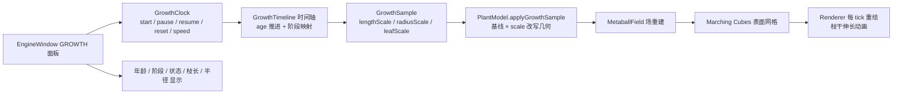

# 第9周：生长时间模型

## 1. 本周目标

把"静态植物"升级为"会随时间生长的植物"：建立系统时间与植物年龄，定义幼苗期 / 生长期 / 成熟期，让枝干长度、枝干半径、叶片大小随年龄按 Logistic 曲线连续变化，并提供生长速度、时间步长与开始 / 暂停 / 继续 / 重置控制，最终在视口中以逐帧动画呈现"枝干伸长"。



## 2. 核心文件

- `include/Engine/GrowthTimeline.h` / `src/Engine/GrowthTimeline.cpp`：时间轴（纯数学 / 状态类，无 Qt signals，可离线采样）
- `include/Engine/GrowthClock.h` / `src/Engine/GrowthClock.cpp`：QTimer 播放控制器
- `include/Engine/GrowthStateReport.h`：单帧生长快照
- `include/Engine/SimulationEngine.h` / `src/Engine/SimulationEngine.cpp`：时间轴 → PlantModel → Metaball → 表面网格的桥接
- `src/Plant/PlantModel.cpp`：`captureBaselines()` / `applyGrowthSample()`
- `src/Engine/EngineWindow.cpp`：GROWTH TIMELINE 面板（播放控制 + 速度 + 状态显示）
- `src/Rendering/Renderer.cpp`：植物表面网格渲染（枝干伸长动画）
- `src/Tools/GrowthTimelineDemo.cpp`：CLI 时间轴演示
- `src/Tools/GrowthSurfaceCheck.cpp`：枝干伸长动画数值验证
- `CMakeLists.txt`：新增 `PlantGrowth` 静态库、`GrowthTimelineDemo` 与 `GrowthSurfaceCheck` 目标

## 3. 系统时间与植物年龄

系统时间由 `GrowthClock` 内的 `QTimer`（默认 33ms ≈ 30 FPS）驱动；墙钟经过换算映射到"植物年"：

\[
\Delta y = \frac{\Delta t_{\text{wall}} \cdot speed}{secondsPerYear}
\]

默认 `secondsPerYear = 2.0`（2 秒墙钟 = 1 植物年），`speed` 为播放倍率（0.1x ~ 8.0x）。

`GrowthTimeline` 维护唯一的 `currentAge_` 作为植物年龄；`reset(initialYears)` 可回到任意年龄。`GrowthClock::start()` 遇到已完成状态会自动回到种子（age=0）重新开始。

## 4. 生命周期阶段

阈值定义在 `GrowthAxisThresholds`（单位：年）：

| 阶段 | 年龄区间 | 说明 |
|---|---|---|
| Seed（种子） | — | 枚举预留 |
| **Seedling（幼苗期）** | `[0, seedlingEndYear)` | 默认 `[0, 0.5)` |
| **Vegetative（生长期）** | `[seedlingEndYear, vegetativeEndYear)` | 默认 `[0.5, 3.0)` |
| **Mature（成熟期）** | `[vegetativeEndYear, matureEndYear)` | 默认 `[3.0, 30.0)` |
| 完成态 | `age >= matureEndYear` | 进入 `GrowthPlaybackMode::Completed` |

阶段映射为纯函数 `lifeStageAt(age)`，任何相同年龄必然返回相同结果，便于测试与离线采样。

## 5. 枝干长度 / 半径 / 叶片随时间变化

全部使用 **Logistic（S 形）曲线**，`sample(age)` 为纯函数：

\[
scale(age) = \max\left(minimum, \frac{asymptote}{1 + e^{-rate \cdot (age - midpoint)}}\right)
\]

`GrowthShapeParams` 为三个器官分别定义参数：

| 器官 | 曲线 | 关键参数（默认） |
|---|---|---|
| 枝干长度 | `lengthScale` | `rate=1.6, midpoint=1.5, asymptote=1.0` |
| 枝干半径 | `radiusScale` | `rate=0.9, midpoint=0.7, asymptote=1.45` + 成熟期 `secondaryGrowthRate=0.03` 逐年缓慢增粗 |
| 叶片大小 | `leafScale`（Vec2 整体放缩） | `rate=1.8, midpoint=1.0, asymptote=1.15` |

### 5.1 应用到 PlantModel

`PlantModel::captureBaselines()` 在骨架构建 / 加载时记录每个节点、叶片的**基线**长度 / 半径 / 大小；`applyGrowthSample(sample)` 做两件事：

1. `基线 × scale` 重写每个节点的 `length` / `radius` 与每个叶片的 `size`；
2. **按新 length 沿节点自身方向重算 `position`**（枝干伸长）：root 保持原位，子节点 $= \text{parent}_{\text{new}} + \text{direction} \times \text{length}_{\text{new}}$。

位置重算是必需的——骨架节点位置由 TurtleInterpreter 按 `parent.position + direction * length` 累积生成，若只改 `length` 不改 `position`，表面网格只会变粗而不会长高。

```cpp
node.length = baseL * sample.lengthScale;   // 基线不随时间被"吃掉"
node.radius = baseR * sample.radiusScale;
leaf.size   = baseLeaf * sample.leafScale;
// 前序遍历（父先于子）：同一趟完成 length/radius 与 position 重算
if (node.parent) node.position = node.parent->position + node.direction * node.length;
```

多次推进、暂停、重置都安全，不会累积漂移。

### 5.2 实测曲线（cherry 预设，采样 0.25 年步长）

| age (y) | 阶段 | lengthScale | radiusScale | leafScale |
|---:|---|---:|---:|---:|
| 0.00 | seedling | 0.083 | 0.504 | 0.163 |
| 0.50 | vegetative | 0.168 | 0.660 | 0.332 |
| 1.50 | vegetative | 0.500 | 0.975 | 0.818 |
| 3.00 | mature | 0.856 | 1.225 | 1.100 |
| 30.0 | mature | 1.000 | 1.950 | 1.150 |

## 6. 生长速度参数

`GrowthClock::setSpeed()` → `GrowthTimeline::setSpeed()`（clamp `[0.1, 8.0]`）。速度只改变墙钟→植物年的换算系数，不改变曲线本身；任何年龄的采样结果与速度无关。

UI 中速度滑块范围 `1..80`（即 0.1x .. 8.0x，×10 编码），拖动实时生效并显示 `speedValueLabel`。

## 7. 时间步长控制

- 实时模式：`QTimer` 以 `tickInterval`（可 `setTickInterval(ms)`，最低 8ms）驱动 `advance(deltaYears)`；
- 单步模式：`GrowthClock::stepOnce(deltaYears)` 显式推进一帧（`GrowthPlaybackMode::Step`），供调试 / 离线 / 演示使用。

`GrowthTimelineDemo` 用 `--step 0.25 --duration 32` 以 0.25 年步长推进到成熟，输出 121 个采样点。

## 8. 开始 / 暂停 / 继续 / 重置

| 操作 | GrowthClock | 行为 |
|---|---|---|
| Start | `start()` | 若已完成先重置回 0；进入 `Realtime`，启动 QTimer |
| Pause | `pause()` | 停止 QTimer，`mode = Paused`，冻结 `currentAge_` |
| Resume | `resume()` | 重启 QTimer，`mode = Realtime` |
| Reset | `reset(0)` | 停止、清零 age、回到 `Paused` |

状态机：`Paused → Realtime → Paused → ... → Completed`。完成时自动停表并广播 `growthLogMessage`。

## 9. 本周输出

### 9.1 植物生长时间轴

`GrowthTimeline` 提供 `sample(age)` / `advance(delta)` / `toJson()`，可独立离线采样与持久化。`GrowthTimelineDemo` 生成 `examples/growth_timeline_cherry.json`（含 121 个采样点的 `samples` 表、阶段分布：幼苗期 2、生长期 10、成熟期 109）。

### 9.2 枝干伸长动画

`SimulationEngine` 在每个生长 tick 后依次重建 Metaball 场 → `MarchingCubes::extract` → 通过 `plantSurfaceUpdated(SurfaceMesh)` 信号把新表面网格发给 `Renderer::setPlantSurface()`；Renderer 将 SurfaceMesh 转为带高度渐变色（树干棕→叶冠绿）的 GPU 网格并重绘。16ms 渲染定时器保证连续帧。

`GrowthSurfaceCheck` 工具对同一棵 cherry 树在 age=0 与 age=30 分别提取表面网格，量化验证伸长：

| 时刻 | 顶点 | 三角形 | 高度 | 冠幅 |
|---|---:|---:|---:|---:|
| age=0（幼苗） | 286 | 568 | 0.65 | 0.47 |
| age=30（成熟） | 12560 | 25116 | 5.79 | 3.54 |
| **伸长** | **×43.9** | **×44.2** | **×8.9** | **×7.5** |

```powershell
.\build\Release\GrowthSurfaceCheck.exe --preset cherry
# -> BRANCH ELONGATION CONFIRMED (height x8.90, vertices x43.92)
```

### 9.3 生长速度控制

GROWTH TIMELINE 面板提供 0.1x ~ 8.0x 滑块；`GrowthTimelineDemo` 提供 `--speed` 参数。

### 9.4 生长状态显示

面板实时显示：`Plant age`（年）、`Life stage`（幼苗期 / 生长期 / 成熟期）、`Growth state`（paused / active / completed）、`Branch length`、`Branch radius`。完成时自动禁用 Pause / Resume。

## 10. 构建与验证

```powershell
# Qt 5.14.2 (msvc2017_64) 需加入 PATH
$env:PATH = "D:\Qt\5.14.2\msvc2017_64\bin;" + $env:PATH

# 构建
cmake --build build --config Release --target GrowthTimelineDemo --parallel
cmake --build build --config Release --target GrowthSurfaceCheck --parallel
cmake --build build --config Release --target PlantSimulationSystem --parallel

# CLI 时间轴演示（32 年推进，0.25 年步长）
.\build\Release\GrowthTimelineDemo.exe --preset cherry --mode step --duration 32 --step 0.25 `
  --output examples/growth_timeline_cherry.json `
  --plant-export examples/growth_plant_cherry.json `
  --report examples/growth_report_cherry.json --quiet

# 主程序（GUI：Start/Pause/Resume/Reset + 速度 + 枝干伸长动画）
.\build\Release\PlantSimulationSystem.exe
```

启动日志关键行：

```
Growth timeline ready: thresholds=[0.5, 3.0, 30.0], speed=1.0x
Plant surface ready: vertices=1678, triangles=3140, bounds=[(-1.10, -0.21, -0.23) .. (0.54, 3.89, 0.23)]
```

### 10.1 构建问题修复记录

- `src/Engine/SimulationEngine.h` 存在第9周前的陈旧副本，导致 AUTOMOC 生成旧信号元对象 → 删除副本；
- `include/Engine/SimulationEngine.h`（Q_OBJECT）与源文件不同目录，AUTOMOC 默认不处理 → 将其显式加入 `PlantSimulationSystem` 源列表；
- `MarchingCubes::extract` 由 `SimulationEngine` 调用 → `PlantSimulationSystem` 补充链接 `PlantGeometry`；
- `applyGrowthSample` 最初只改 `length/radius` 不改 `position`，导致"枝干变粗但不伸长"（高度仅 ×1.12）→ 增加按新 length 沿 direction 重算 position 的步骤后，高度 ×8.9、顶点 ×43.9（见 9.2）。

## 11. 示例产物

- `examples/growth_timeline_cherry.json` / `examples/growth_timeline_pine.json`：完整时间轴（thresholds / shape / speeds / state / samples）
- `examples/growth_plant_cherry.json` / `examples/growth_plant_pine.json`：age=30 终态 PlantModel（节点 radius/length/position 已按曲线重算）
- `examples/growth_report_cherry.json` / `examples/growth_report_pine.json`：终态单帧报告（age=30, mature, completed）
